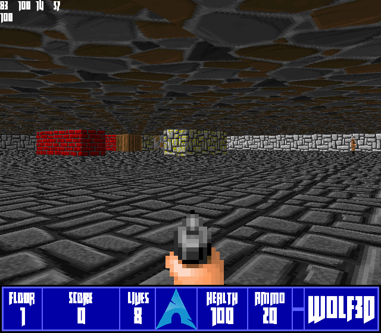

# Wolf3D

Wolf3D is a simple Wolfenstein 3D inspired project game written in C++ using the SDL2 framework for rendering the window.




## Build from source

Doxygen can be found at [https://aikufurr.github.io/Wolf3DDoxygen](https://aikufurr.github.io/Wolf3DDoxygen/hierarchy.html) 

### Use [git](https://git-scm.com/) to clone the repository
```bash
git clone https://github.com/Aikufurr/Wolf3D.git
```
### Install dependencies

#### [Arch Linux](https://archlinux.org/) using [pacman](https://wiki.archlinux.org/title/pacman):
```bash
# Update, GCC/G++, SDL2 + {image, mixer, tff}
sudo pacman -Syu gcc sdl2{,_{image,mixer,ttf}} --needed
```
#### [Ubuntu](https://ubuntu.com/) using [apt](https://help.ubuntu.com/community/AptGet/Howto):
```bash
# Update
sudo apt update

# GCC/G++
sudo apt install build-essential -y

# SDL2
sudo apt install libsdl2-dev libsdl2-2.0-0 -y;

# SDL Image
sudo apt install libsdl2-image-dev libsdl2-image-2.0-0 -y;

# SDL Mixer
sudo apt install libsdl2-mixer-dev libsdl2-mixer-2.0-0 -y;

# SDL True Type Fonts (TTF)
sudo apt install libfreetype6-dev libsdl2-ttf-dev libsdl2-ttf-2.0-0 -y;
```

#### [Windows 10](https://www.microsoft.com/en-gb/windows/get-windows-10) (NOT TESTED / UNSUPPORTED):
#### Install Mingw
1. Get the latest version of Mingw-w64 via [MSYS2](https://www.msys2.org/), which provides up-to-date native builds of GCC, Mingw-w64, and other helpful C++ tools and libraries. [Click here](https://github.com/msys2/msys2-installer/releases/download/2021-06-04/msys2-x86_64-20210604.exe) to download the MSYS2 installer. Then follow the instructions on the [MSYS2 website](https://www.msys2.org/) to install Mingw-w64.
2. Add the path to your Mingw-w64 `bin` folder to the Windows `PATH` environment variable by using the following steps:

    1. In the Windows search bar, type 'settings' to open your Windows Settings.
    2. Search for **Edit environment variables for your account**.
    3. Choose the Path variable and then select **Edit**.
    4. Select **New** and add the Mingw-w64 destination folder path to the system path. The exact path depends on which version of Mingw-w64 you have installed and where you installed it. If you used the settings above to install Mingw-w64, then add this to the path: `C:\msys64\mingw64\bin`.
    5. Select **OK** to save the updated PATH. You will need to reopen any console windows for the new PATH location to be available.
#### Install vckpg
1. Clone the vcpkg repo
```bash
git clone https://github.com/Microsoft/vcpkg.git
```
2. Run the bootstrap script to build vcpkg
```bash
./vcpkg/bootstrap-vcpkg.sh
```
#### Install SDL2
```bash
# 32 Bit
vcpkg install sdl2 sdl2-image sdl2-mixer sdl2-net sdl2-ttf
# 64 Bit
vcpkg install --target x64-windows sdl2 sdl2-image sdl2-mixer sdl2-net sdl2-ttf
```

---

### Compile and run

```bash
# Compile and assemble the C++ code to object code
g++ -c src/*.cpp -std=c++14 -m64 -g -Wall

# Compile the object code
g++ *.o -o bin/debug/main -lSDL2main -lSDL2 -lSDL2_image -lSDL2_ttf -lSDL2_mixer

# Run binary
./bin/debug/main
```

---

## Contributing
Pull requests are welcome.

Please make sure to test any changes you made before making a PR.

## License
[GNU General Public License v3.0](https://choosealicense.com/licenses/gpl-3.0/)


| Permissions    | Conditions                   | Limitations |
| -------------- | ---------------------------- | ----------- |
| Commercial use | Disclose source              | Liability   |
| Distribution   | License and copyright notice | Warranty    |
| Modification   | Same license                 |             |
| Patent use     | State changes                |             |
| Private use    |                              |             |
